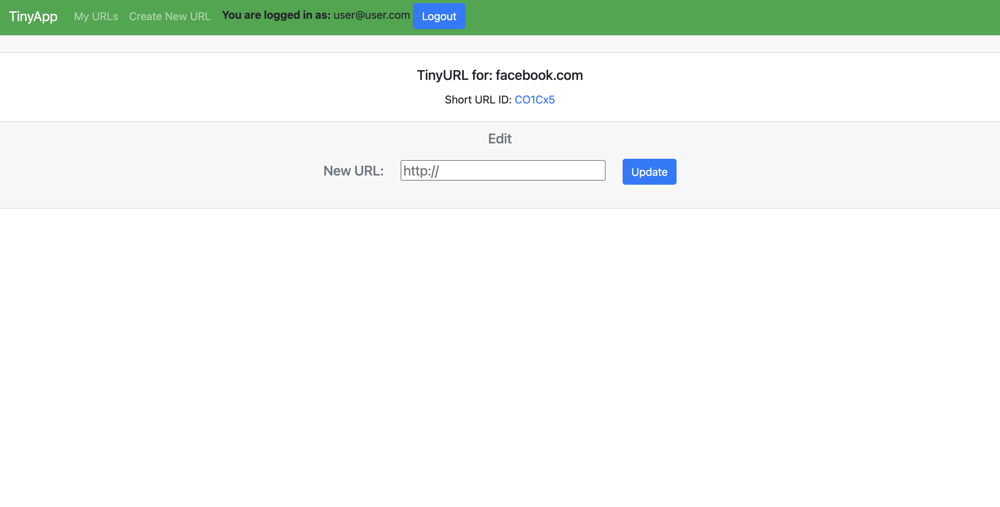

# TinyApp Project

TinyApp is a full stack web application built with Node and Express that allows users to shorten long URLs (à la bit.ly).

## Final Product

*Main page without an active user*

*Main page with an active user, displaying created links*

*Registration page*

*Specific short URL page where user owns the short URL*

*For a more in depth look at TinyApp, and to create your own short links, I encourage you to give it a try!*

## Dependencies

- Node.js
- Express
- EJS
- bcryptjs
- cookie-session

## Getting Started

- Install all dependencies (using the `npm install` command).
- Run the development web server using the `node express_server.js` command.